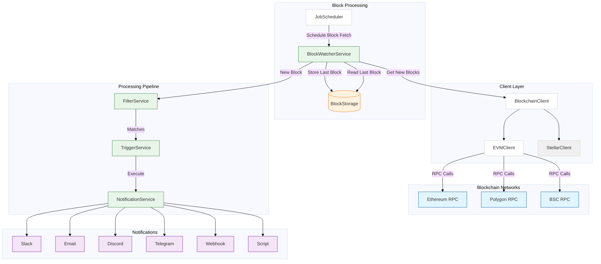

# OpenZeppelin Monitor

[](https://codecov.io/gh/OpenZeppelin/openzeppelin-monitor)
[](https://api.securityscorecards.dev/projects/github.com/OpenZeppelin/openzeppelin-monitor)
[](https://github.com/OpenZeppelin/openzeppelin-monitor/actions/workflows/cla.yml)
[](https://github.com/OpenZeppelin/openzeppelin-monitor/actions/workflows/ci.yaml)
[](https://github.com/OpenZeppelin/openzeppelin-monitor/actions/workflows/release-please.yml)


> :warning: This software is in alpha. Use in production environments at your own risk.

In the rapidly evolving world of blockchain technology, effective monitoring is crucial for ensuring security and performance. OpenZeppelin Monitor is a blockchain monitoring service that watches for specific on-chain activities and triggers notifications based on configurable conditions. The service offers multi-chain support with configurable monitoring schedules, flexible trigger conditions, and an extensible architecture for adding new chains.

[Install](https://docs.openzeppelin.com/monitor#getting_started) | [User Docs](https://docs.openzeppelin.com/monitor) | [Quickstart](https://docs.openzeppelin.com/monitor/quickstart) | [Crate Docs](https://docs.openzeppelin.com/monitor/rust_docs/doc/openzeppelin_monitor/)

## Features

- Multi-chain support
- Configurable monitoring schedules
- Flexible trigger conditions
- Extensible architecture for adding new chains

## Supported Networks

- EVM
- Stellar

## Supported Triggers

- Slack notifications
- Email notifications
- Discord notifications
- Telegram notifications
- Webhook notifications
- Script notifications

## For Users

### Installation

View the [Installation](https://docs.openzeppelin.com/monitor#getting_started) documentation for detailed information. For a quicker introduction, check out the [Quickstart](https://docs.openzeppelin.com/monitor/quickstart) guide.

### Usage

View the [Usage](https://docs.openzeppelin.com/monitor#running_the_monitor) documentation for more information.

## For Developers

### Technical Overview

The following diagram illustrates the architecture of the monitoring service, highlighting key components and their interactions.



### Project Structure

```sh
openzeppelin-monitor/
├── src/                # Source code
│   ├── bootstrap/      # Bootstrap functions for the application
│   ├── models/         # Data structures and types
│   ├── repositories/   # Configuration storage
│   ├── services/       # Core business logic
│   ├── utils/          # Helper functions
│
├── config/             # Configuration files
├── tests/              # Integration and property-based tests
├── data/               # Runtime data storage
├── docs/               # Documentation
├── scripts/            # Utility scripts
├── cmd/                # Metrics and monitoring
├── examples/           # Example configuration files
└── ... other root files (Cargo.toml, README.md, etc.)
```

### Setup

To get started, run the following commands to install pre-commit hooks:

- Install pre-commit hooks:

  ```bash
  pip install pre-commit
  pre-commit install --install-hooks -t commit-msg -t pre-commit -t pre-push
  ```

  > :warning: If you encounter issues with pip, consider using [pipx](https://pipx.pypa.io/stable/installation/) for a global installation.

- Install the toolchain:

  ```bash
  rustup component add rustfmt
  ```

### Run Tests

To run tests, use the following commands:

```bash
RUST_TEST_THREADS=1 cargo test
RUST_TEST_THREADS=1 cargo test properties
RUST_TEST_THREADS=1 cargo test integration
```

### Generate Test Coverage Report

_Interactive HTML Report_

```sh
RUST_TEST_THREADS=1 cargo +stable llvm-cov --html --open
```

_CLI Report_

```sh
RUST_TEST_THREADS=1 cargo +stable llvm-cov
```

## Important Considerations

### Performance Considerations

- Monitor performance depends on network congestion and RPC endpoint reliability.
- The `max_past_blocks` configuration is critical:
  - Calculate as: `(cron_interval_ms/block_time_ms) + confirmation_blocks + 1` (defaults to this calculation if not specified).
  - Example for 1-minute Ethereum cron: `(60000/12000) + 12 + 1 = 18 blocks`.
  - Too low settings may result in missed blocks.
- Trigger conditions are executed sequentially based on their position in the trigger conditions array. Proper execution also depends on the number of available file descriptors on your system. Ideally, you should increase the open file descriptor limit to at least 2,048 or higher for optimal performance.
  - Security Risk: Only run scripts that you trust and fully understand. Malicious scripts can harm your system or expose sensitive data. Always review script contents and verify their source before execution.
  - HTTP requests to RPC endpoints may consume file descriptors for each connection. The number of concurrent connections can increase significantly when processing blocks with many transactions, as each transaction may require multiple RPC calls.

### Notification Considerations

- Email notification port defaults to 465 if not specified.
- Template variables are context-dependent:
  - Event-triggered notifications only populate event variables.
  - Function-triggered notifications only populate function variables.
  - Mixing contexts results in empty values.

## Contributing

We welcome contributions from the community! Here's how you can get involved:

1. Fork the repository
2. Create your feature branch
3. Commit your changes
4. Push to the branch
5. Create a Pull Request

If you are looking for a good place to start, find a good first issue [here](https://github.com/openzeppelin/openzeppelin-monitor/issues?q=is%3Aissue%20is%3Aopen%20label%3Agood-first-issue).

You can open an issue for a [bug report](https://github.com/openzeppelin/openzeppelin-monitor/issues/new?assignees=&labels=T-bug%2CS-needs-triage&projects=&template=bug.yml), [feature request](https://github.com/openzeppelin/openzeppelin-monitor/issues/new?assignees=&labels=T-feature%2CS-needs-triage&projects=&template=feature.yml), or [documentation request](https://github.com/openzeppelin/openzeppelin-monitor/issues/new?assignees=&labels=T-documentation%2CS-needs-triage&projects=&template=docs.yml).

You can find more details in our [Contributing](CONTRIBUTING.md) guide.

Please read our [Code of Conduct](CODE_OF_CONDUCT.md) and check the [Security Policy](SECURITY.md) for reporting vulnerabilities.

## License

This project is licensed under the GNU Affero General Public License v3.0 - see the [LICENSE](LICENSE) file for details.

## Security

For security concerns, please refer to our [Security Policy](SECURITY.md).

## Get Help

If you have any questions, first see if the answer to your question can be found in the [User Documentation](https://docs.openzeppelin.com/monitor).

If the answer is not there:

- Join the [Telegram](https://t.me/openzeppelin_tg/4) to get help, or
- Open an issue with [the bug](https://github.com/openzeppelin/openzeppelin-monitor/issues/new?assignees=&labels=T-bug%2CS-needs-triage&projects=&template=bug.yml)

We encourage you to reach out with any questions or feedback.

## Maintainers

See [CODEOWNERS](CODEOWNERS) file for the list of project maintainers.
