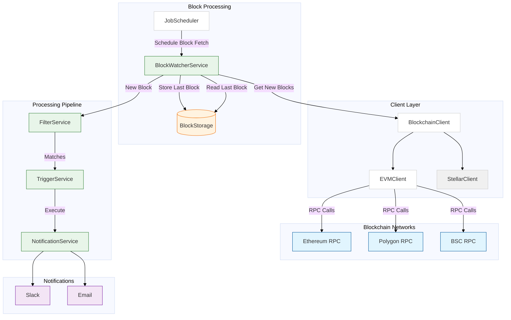

# OpenZeppelin Monitor

A blockchain monitoring service that watches for specific on-chain activities and triggers notifications based on configurable conditions. The service offers multi-chain support with configurable monitoring schedules, flexible trigger conditions, and an extensible architecture for adding new chains.

## Architecture



## Supported Networks

- EVM
- Stellar

## Supported Triggers

- Slack notifications
- Email notifications

## Prerequisites

- Rust 2021 edition

## Installation

### Local Setup

1. Clone the repository:

```bash
git clone https://github.com/openzeppelin/openzeppelin-monitor
cd openzeppelin-monitor
```

2. Install dependencies:

```bash
cargo build
```

## Configuration

1. Copy example configuration files:

```bash
# EVM
cp config/monitors/evm_transfer_usdc.json.example config/monitors/evm_transfer_usdc.json
cp config/networks/ethereum_mainnet.json.example config/networks/ethereum_mainnet.json
cp config/triggers/email_notifications.json.example config/triggers/email_notifications.json
cp config/triggers/slack_notifications.json.example config/triggers/slack_notifications.json

# Stellar
cp config/monitors/stellar_transfer_usdc.json.example config/monitors/stellar_transfer_usdc.json
cp config/networks/stellar_mainnet.json.example config/networks/stellar_mainnet.json
cp config/triggers/email_notifications.json.example config/triggers/email_notifications.json
cp config/triggers/slack_notifications.json.example config/triggers/slack_notifications.json
```

2. Configure your networks in `config/networks/`:

- EVM networks: See `evm_mainnet.json`
- Stellar networks: See `stellar_mainnet.json`

3. Configure your monitors in `config/monitors/`:

- EVM monitors: See `evm_transfer_usdc.json`
- Stellar monitors: See `stellar_transfer_usdc.json`

4. Configure your triggers in `config/triggers/`:

- Slack notifications: See `slack_notifications.json`
- Email notifications: See `email_notifications.json`

### Monitor Argument Access

- **Stellar**: Arguments are accessed by numeric index:

  - For function `transfer(Address,Address,I128)`
    - Access via [0, 1, 2]
    - For example: `"expression": "2 > 1000"`

- **EVM**: Arguments are accessed by parameter names defined in the ABI:

  - For event `Transfer(address from, address to, uint256 value)`
    - Access via ["from", "to", "value"]
    - For example: `"expression": "value > 10000000000"`

### Condition Evaluation Rules

- No conditions → All transactions match
- Transaction-only conditions → Only transaction properties are checked
- Event/function conditions → Either event or function matches trigger
- Both transaction and event/function conditions → Both must be satisfied

### Template Variables

Template variables may be used to inject specific values related to the monitor match into the body of the notification.

- **Common Variables**:

  - `monitor_name`: Name of the triggered monitor
  - `transaction_hash`: Hash of the transaction
  - `function_[index]_signature`: Signature of the function (e.g. `function_0_signature`)
  - `event_[index]_signature`: Signature of the event (e.g. `event_0_signature`)

- **EVM-specific Variables**:

  - `transaction_from`: Sender address
  - `transaction_to`: Recipient address
  - `transaction_value`: Transaction value
  - `event_[index]_[param]`: Event parameters (e.g., `event_0_value`)
  - `function_[index]_[param]`: Function parameters (e.g., `function_0_amount`)

- **Stellar-specific Variables**:
  - `event_[index]_[position]`: Event parameters by position (e.g., `event_0_0`)
  - `function_[index]_[position]`: Function parameters by position (e.g., `function_0_2`)
  - Note: `transaction_from`, `transaction_to`, and `transaction_value` are not available

Example usage in trigger body:

For EVM:
`"body": "Transfer of ${event_0_value} from ${transaction_from}"`

For Stellar:
`"body": "Transfer of ${function_0_2} from account ${function_0_0}"`

## Usage

### Run Locally

```bash
RUST_LOG=info cargo run
```

### Run Tests

```bash
RUST_LOG=info cargo test -- --nocapture
```

## Project Structure

- `src/`: Source code
  - `models/`: Data structures and types
  - `repositories/`: Configuration storage
  - `services/`: Core business logic
  - `utils/`: Helper functions
- `config/`: Configuration files
- `tests/`: Integration tests
- `data/`: Runtime data storage

## Caveats

- This software is in alpha. Use in production environments at your own risk.
- Monitor performance depends on network congestion and RPC endpoint reliability.
- Past block processing is limited by `max_past_blocks` in network configuration (default: 10).
- For email notifications, the `port` field is optional and defaults to 465.
- Template variable availability depends on the trigger source:
  - If triggered by an event, only event variables will be populated.
  - If triggered by a function, only function variables will be populated.
  - Using event variables in a function-triggered notification (or vice versa) will result in empty values.

## Contributing

1. Fork the repository
2. Create your feature branch
3. Commit your changes
4. Push to the branch
5. Create a Pull Request

Please read our [Code of Conduct](CODE_OF_CONDUCT.md) and check the [Security Policy](SECURITY.md) for reporting vulnerabilities.

## License

This project is licensed under the GNU Affero General Public License v3.0 - see the [LICENSE](LICENSE) file for details.

## Security

For security concerns, please refer to our [Security Policy](SECURITY.md).

## Contact

For support or inquiries, contact defender-support@openzeppelin.com.

## Maintainers

See [CODEOWNERS](CODEOWNERS) file for the list of project maintainers.
