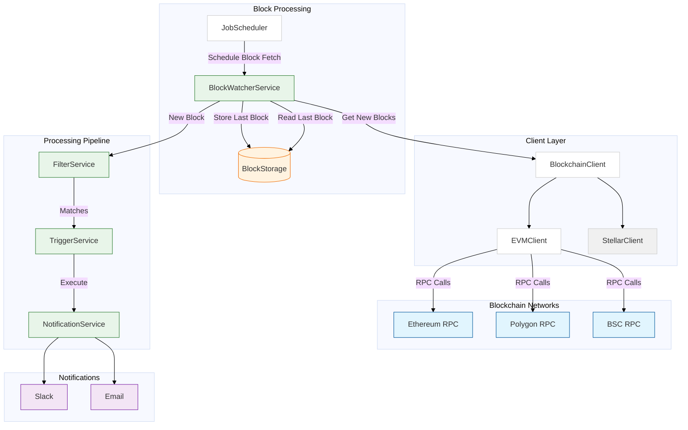

# OpenZeppelin Monitor

[](https://codecov.io/gh/OpenZeppelin/openzeppelin-monitor)

A blockchain monitoring service that watches for specific on-chain activities and triggers notifications based on configurable conditions. The service offers multi-chain support with configurable monitoring schedules, flexible trigger conditions, and an extensible architecture for adding new chains.

## Features

- Multi-chain support
- Configurable monitoring schedules
- Flexible trigger conditions
- Extensible architecture for adding new chains

## Supported Networks

- EVM
- Stellar

## Supported Triggers

- Slack notifications
- Email notifications

## Architecture



## Prerequisites

- Rust 2021 edition

## Installation

### Local Setup

- Clone the repository:

  ```sh
  git clone https://github.com/openzeppelin/openzeppelin-monitor
  cd openzeppelin-monitor
  ```

- Install dependencies:

  ```sh
  cargo build
  ```

## Configuration

- Configure your environment variables in `.env` file.

  ```sh
  cp .env.example .env
  ```

- Copy example configuration files:

  ```sh
  # EVM
  cp config/monitors/evm_transfer_usdc.json.example config/monitors/evm_transfer_usdc.json
  cp config/networks/ethereum_mainnet.json.example config/networks/ethereum_mainnet.json
  cp config/triggers/email_notifications.json.example config/triggers/email_notifications.json
  cp config/triggers/slack_notifications.json.example config/triggers/slack_notifications.json

  # Stellar
  cp config/monitors/stellar_transfer_usdc.json.example config/monitors/stellar_transfer_usdc.json
  cp config/networks/stellar_mainnet.json.example config/networks/stellar_mainnet.json
  cp config/triggers/email_notifications.json.example config/triggers/email_notifications.json
  cp config/triggers/slack_notifications.json.example config/triggers/slack_notifications.json
  ```

### Configuration Files

#### Network Configuration (`config/networks/`)

Configure your blockchain network connections:

- For EVM networks: Use `ethereum_mainnet.json` as template
- For Stellar networks: Use `stellar_mainnet.json` as template

> **Important**: We strongly recommend using private RPC providers for improved reliability.

#### Monitor Configuration (`config/monitors/`)

Set up your blockchain monitoring rules:

- For EVM networks: Use `evm_transfer_usdc.json` as template
- For Stellar networks: Use `stellar_transfer_usdc.json` as template

> **Note**: For EVM monitors, you must include the contract ABI when monitoring events or functions. Update all addresses to match your monitoring targets.

#### Trigger Configuration (`config/triggers/`)

Configure notification settings:

- For Slack: Use `slack_notifications.json` as template
  - Required: Update `webhook_url` with your Slack webhook URL
- For Email: Use `email_notifications.json` as template
  - Required: Update all SMTP settings with your email server configuration

### Monitor Argument Access

- **EVM**: Arguments are accessed by parameter names defined in the ABI:

  - For event `Transfer(address from, address to, uint256 value)`
    - Access via ["from", "to", "value"]
    - For example: `"expression": "value > 10000000000"`

- **Stellar**: Arguments are accessed by numeric index:

  - For function `transfer(Address,Address,I128)`
    - Access via [0, 1, 2]
    - For example: `"expression": "2 > 1000"`

### Condition Evaluation Rules

- No conditions → All transactions match
- Transaction-only conditions → Only transaction properties are checked
- Event/function conditions → Either event or function matches trigger
- Both transaction and event/function conditions → Both must be satisfied

### Template Variables

Template variables may be used to inject specific values related to the monitor match into the body of the notification.

- **Common Variables**:

  - `monitor_name`: Name of the triggered monitor
  - `transaction_hash`: Hash of the transaction
  - `function_[index]_signature`: Signature of the function (e.g. `function_0_signature`)
  - `event_[index]_signature`: Signature of the event (e.g. `event_0_signature`)

- **EVM-specific Variables**:

  - `transaction_from`: Sender address
  - `transaction_to`: Recipient address
  - `transaction_value`: Transaction value
  - `event_[index]_[param]`: Event parameters (e.g., `event_0_value`)
  - `function_[index]_[param]`: Function parameters (e.g., `function_0_amount`)

- **Stellar-specific Variables**:
  - `event_[index]_[position]`: Event parameters by position (e.g., `event_0_0`)
  - `function_[index]_[position]`: Function parameters by position (e.g., `function_0_2`)
  - Note: `transaction_from`, `transaction_to`, and `transaction_value` are not available

Example usage in trigger body:

For EVM:
`"body": "Transfer of ${event_0_value} from ${transaction_from}"`

For Stellar:
`"body": "Transfer of ${function_0_2} from account ${function_0_0}"`

## Usage

### Run Locally

```sh
cargo run
```

### Run as a container

You have the option of running as a development container or as production one (`Dockerfile.development` and `Dockerfile.production`).

To adjust the `.env` file, you can edit `env_dev` or `env_prod` at the root of the repository.

Assuming your docker environment is installed and properly set up, you can build the image with:

```sh
docker build --tag <your_image_tag> -f Dockerfile.<development | production> --squash-all
```

or with buildx:

```sh
docker buildx build -f Dockerfile.<env> -t <name_of_image:tag> .
```

This will generate an image including the appropriate `.env` file and the configurations in the `./config` folder.

Now we need to create the docker volume to keep the monitor internal data (if you want to keep it when you restart the container, otherwise just skip this step).

```sh
docker volume create <volume_tag>
```

After the build is finished, you can run it with:

```sh
docker run --volume <volume_tag>:/app/data <your_image_tag>`
```

If you need to change the monitor configurations, there's no need to rebuild the image. Assuming you have the configuration files in `./config`, you can just bind the directory to the container:

```sh
docker run --mount type=bind,src=./config,dst=/app/config,ro --volume <volume_tag>:/app/data <your_image_tag>
```

### Run Tests

```bash
RUST_TEST_THREADS=1 cargo test
RUST_TEST_THREADS=1 cargo test properties
RUST_TEST_THREADS=1 cargo test integration
```

### Generate Test Coverage Report

_Interactive HTML Report_

```sh
RUST_TEST_THREADS=1 cargo +stable llvm-cov --html --open
```

_Terminal Report_

```sh
RUST_TEST_THREADS=1 cargo +stable llvm-cov
```

### Developer setup

- Run the following commands to install pre-commit hooks:

  ```bash
   # Use <pipx install pre-commit> if you prefer to install it globally.
   pip install pre-commit
   pre-commit install --install-hooks -t commit-msg -t pre-commit -t pre-push
  ```

  > Note: If you run into issues with pip install, you may need [pipx](https://pipx.pypa.io/stable/installation/) to install pre-commit globally.

- Run `rustup toolchain install nightly` to install the nightly toolchain.
- Run `rustup component add rustfmt --toolchain nightly` to install rustfmt for the nightly toolchain.

## Project Structure

- `src/`: Source code
  - `models/`: Data structures and types
  - `repositories/`: Configuration storage
  - `services/`: Core business logic
  - `utils/`: Helper functions
- `config/`: Configuration files
- `tests/`: Integration tests
- `data/`: Runtime data storage
- `docs/`: Documentation
- `scripts/`: Utility scripts

## Documentation

- Pre-requisites:

  - You need `antora` `site-generator` and `mermaid` extension to generate the documentation.

  - You can directly install these dependencies by running `cd docs && npm i --include dev`. If you want to install them manually, you can follow the steps mentioned below.
  - Install `antora` locally, you can follow the steps mentioned [here](https://docs.antora.org/antora/latest/install/install-antora/#install-dir), if you already have you can skip this step.
    > Note: If you want to install globally, you can run: <br/> `npm install -g @antora/cli@3.1 @antora/site-generator@3.1 @sntke/antora-mermaid-extension`
  - Verify the installation by running `antora --version` or by running `npx antora --version` if you installed it locally.

- To generate documentation locally, run the following command:

  ```sh
  cargo make rust-antora
  ```

- Site will be generated in `docs/build/site/OpenZeppelin_Monitor/<version>/` directory.

- To view the documentation, open the `docs/build/site/OpenZeppelin_Monitor/<version>/index.html` in your browser.

## Caveats

- This software is in alpha. Use in production environments at your own risk.
- EVM monitors require an ABI to decode and trigger on contract events and functions.
- Monitor performance depends on network congestion and RPC endpoint reliability.
- The `max_past_blocks` configuration is critical to prevent missing blocks:
  - Should be approximately calculated as: `(cron_interval_ms/block_time_ms) + confirmation_blocks + 1` (defaults to this value if not set)
  - Example: For 1-minute cron on Ethereum (~12s blocks, 12 confirmation blocks):
    - `(60000/12000) + 12 + 1 = 18 blocks`
  - Setting this too low may result in missed blocks, especially on fast networks
  - Consider network congestion and block time variability when configuring
- For email notifications, the `port` field is optional and defaults to 465.
- Template variable availability depends on the trigger source:
  - If triggered by an event, only event variables will be populated.
  - If triggered by a function, only function variables will be populated.
  - Using event variables in a function-triggered notification (or vice versa) will result in empty values.

## Contributing

Contributing to this repository involves a few main actions:

1. Fork the repository
2. Create your feature branch
3. Commit your changes
4. Push to the branch
5. Create a Pull Request

You can open an issue for a [bug report](https://github.com/openzeppelin/openzeppelin-monitor/issues/new?assignees=&labels=T-bug%2CS-needs-triage&projects=&template=bug.yml), [feature request](https://github.com/openzeppelin/openzeppelin-monitor/issues/new?assignees=&labels=T-feature%2CS-needs-triage&projects=&template=feature.yml), or [documentation request](https://github.com/openzeppelin/openzeppelin-monitor/issues/new?assignees=&labels=T-documentation%2CS-needs-triage&projects=&template=docs.yml).

You can find more details in our [Contributing](CONTRIBUTING.md) guide.

Please read our [Code of Conduct](CODE_OF_CONDUCT.md) and check the [Security Policy](SECURITY.md) for reporting vulnerabilities.

## License

This project is licensed under the GNU Affero General Public License v3.0 - see the [LICENSE](LICENSE) file for details.

## Security

For security concerns, please refer to our [Security Policy](SECURITY.md).

## Contact

For support or inquiries, contact <defender-support@openzeppelin.com>.

## Maintainers

See [CODEOWNERS](CODEOWNERS) file for the list of project maintainers.
